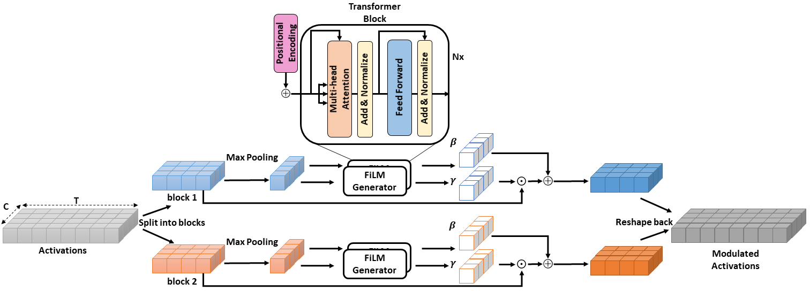

# Self-Attention for Audio Super-resolution 
### [Paper arXiv](https://arxiv.org/abs/2108.11637)
### [Paper IEEE Xplore](https://ieeexplore.ieee.org/abstract/document/9596082)



## Dependencies

The model is implemented in Python 3.7.12 \
Additional packages: 
- `tensorflow==2.6.0`
- `keras==2.6.0`
- `h5py==3.1.0`
- `numpy==1.19.5`
- `scipy==1.4.1`

## Data
Data preparation is the same as [TFiLM](https://github.com/kuleshov/audio-super-res) . The main dataset is VCTK speech. The model expects `.h5` archives contaning pairs of high and low resolution sound patches. 

## Pre-trained models
The shared models were trained in a similar way to previous audio super-resolution models for fair comparison purposes. You will be able to get better results by training them longer. Moreover, the models do not generalize to other domains. If you recordings are very different from the dataset, you should collect additional data. 

| Scale |   Dataset   |   Model  |
|-------|:-----------:|:--------:|
| 2     |  VCTK Multi | [Download](https://drive.google.com/file/d/1jH3JVShN06uoQKh5-muP8U-iu9HSIB_-/view?usp=sharing) |
| 4     | VCTK Multi  | [Download](https://drive.google.com/file/d/17KMnH3FsAK8fsPC-HFefNfIM6uyJqi4X/view?usp=sharing) |
| 8     | VCTK Multi  | [Download](https://drive.google.com/file/d/1TioGTRT-YQHaXS39HJsc9CvJlYWWzZ9y/view?usp=sharing) |

## Training
Run the `codes/train.py` script.
```
usage: train.py [-h] [--model {afilm,tfilm}] --train TRAIN --val VAL
                [-e EPOCHS] [--batch-size BATCH_SIZE] [--logname LOGNAME]
                [--layers LAYERS] [--alg ALG] [--lr LR]
                [--save_path SAVE_PATH] [--r R] [--pool_size POOL_SIZE]
                [--strides STRIDES]

optional arguments:
  -h, --help            show this help message and exit
  --model {afilm,tfilm}
                        model to train
  --train TRAIN         path to h5 archive of training patches
  --val VAL             path to h5 archive of validation set patches
  -e EPOCHS, --epochs EPOCHS
                        number of epochs to train
  --batch-size BATCH_SIZE
                        training batch size
  --logname LOGNAME     folder where logs will be stored
  --layers LAYERS       number of layers in each of the D and U halves of the
                        network
  --alg ALG             optimization algorithm
  --lr LR               learning rate
  --save_path SAVE_PATH
                        path to save the model
  --r R                 upscaling factor
  --pool_size POOL_SIZE
                        size of pooling window
  --strides STRIDES     pooling stide
```

## Testing 
Run the `codes/test.py` script.
```
usage: test.py [-h] --pretrained_model PRETRAINED_MODEL
               [--out-label OUT_LABEL] [--wav-file-list WAV_FILE_LIST]
               [--layers LAYERS] [--r R] [--sr SR] [--patch_size PATCH_SIZE]

optional arguments:
  -h, --help            show this help message and exit
  --pretrained_model PRETRAINED_MODEL
                        path to pre-trained model
  --out-label OUT_LABEL
                        append label to output samples
  --wav-file-list WAV_FILE_LIST
                        list of audio files for evaluation
  --layers LAYERS       number of layers in each of the D and U halves of the
                        network
  --r R                 upscaling factor
  --sr SR               high-res sampling rate
  --patch_size PATCH_SIZE
                        Size of patches over which the model operates
```

## Citation  

    @INPROCEEDINGS{9596082,
    author={Rakotonirina, Nathanaël Carraz},
    booktitle={2021 IEEE 31st International Workshop on Machine Learning for Signal Processing (MLSP)}, 
    title={Self-Attention for Audio Super-Resolution}, 
    year={2021},
    volume={},
    number={},
    pages={1-6},
    keywords={Training;Recurrent neural networks;Convolution;Superresolution;Modulation;Machine learning;Network architecture;audio super-resolution;bandwidth extension;self-attention},
    doi={10.1109/MLSP52302.2021.9596082}}


